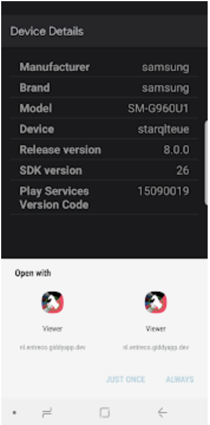

# Dynamic-feature-disambiguation
Minimal setup to reproduce dynamic-feature disambiguation
The original Stackoverflow question can be found here:
https://stackoverflow.com/questions/57340444/instant-app-with-dynamic-features-always-show-disambiguation-dialog-with-1-optio#

Sample showing the Disambiguation Dialog:

Even though the setup seems right (all steps listed https://developer.android.com/training/app-links/verify-site-associations seem to work as expected), I still see the Disambiguation dialog

